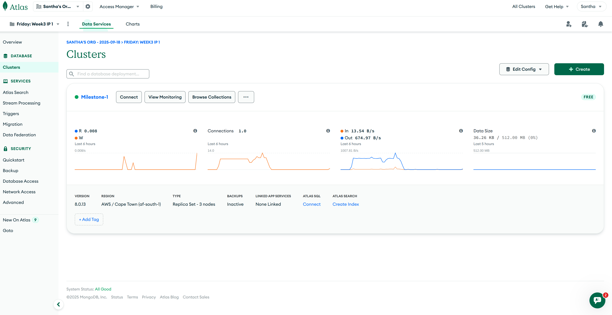
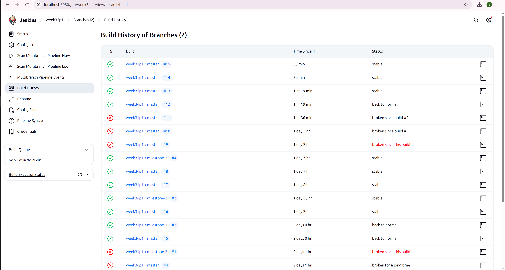
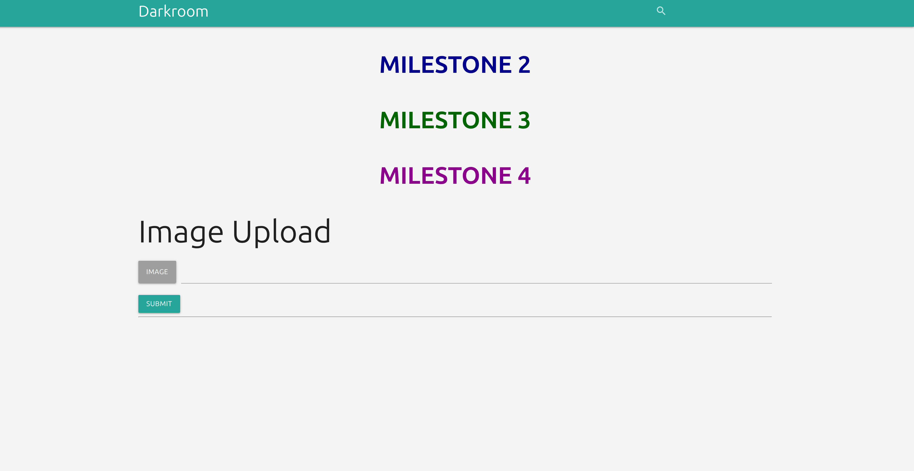
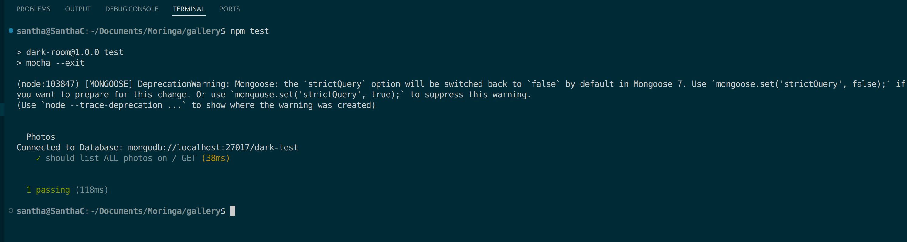
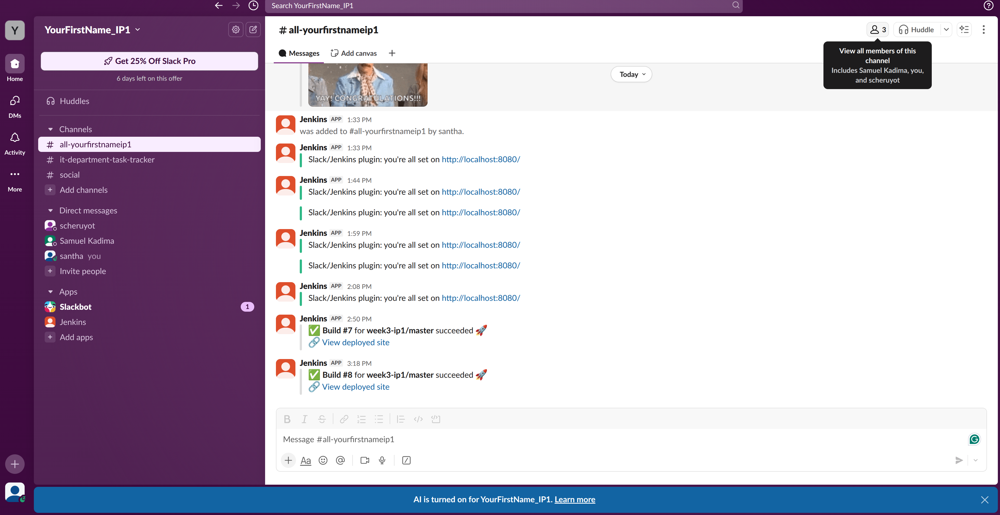
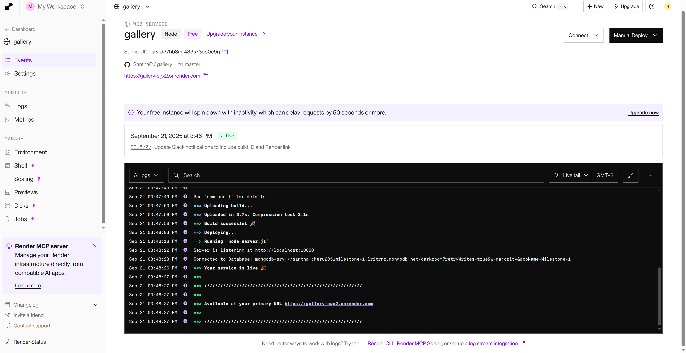

# Dark Room Project

This repository contains the Dark Room project, a photo gallery web application. This README outlines the milestones achieved, setup instructions, and screenshots for verification.


## **Milestone 1 – Setup**

### Achievements
- Forked and cloned the GitHub repository.
- Created a MongoDB Atlas cluster and whitelisted IPs.
- Created a database user and copied the connection string.
- Updated `_config.js` to use Atlas URI.
- Verified connection directly in `server.js` (removed `test-mongo.js` as it is no longer needed).
- Successfully ran the application and uploaded images.

### Screenshots

**MongoDB Atlas Cluster:**  



---

## **Milestone 2 – Jenkins Pipeline & Render Deployment**

### Achievements
- Created a Jenkins pipeline that installs dependencies, builds, and deploys.
- Configured the pipeline to trigger automatically on pushes to GitHub.
- Successfully deployed the app to Render.
- Updated the landing page to visibly display **“MILESTONE 2”**.

### Screenshots

**Jenkins Pipeline Setup:**  


**Render Deployment with Milestone 2 Banner:**  


---

## **Milestone 3 – Tests Integration & Banner**

### Achievements
- Merged tests from the `test` branch into `main`.
- Jenkins pipeline updated to run tests and send email notifications on failure.
- Added a **MILESTONE 3** banner to the landing page.
- Verified pipeline success and Render deployment.

### Screenshots

**Mocha Test Results:**  


**Updated Landing Page (MILESTONE 3):**  


**Jenkins Pipeline Running Tests:**  
.png)
.png)
.png)
.png)
.png)
---

## **Milestone 4 – Slack Notifications & Final Banner**

### Achievements
- Integrated Slack for Jenkins build notifications.
- Added Slack notifications for new photo uploads.
- Updated landing page with **MILESTONE 4** banner.
- Verified Jenkins pipeline, Slack notifications, and Render deployment.

### Screenshots

**Slack Build Success Notification:**  



**Updated Landing Page (MILESTONE 4):**  


**Render Deployment:**  


---

## **Setup Instructions**

### 1. Clone Repository
```bash
git clone https://github.com/SanthaC/gallery.git
cd gallery
