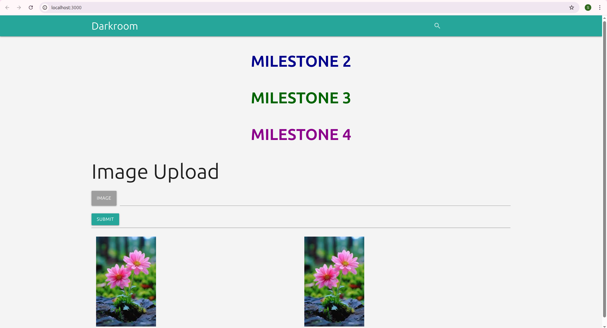

Dark Room Project

This repository contains the Dark Room project, a photo gallery web application. This README outlines the milestones achieved, setup instructions, and screenshots for verification as per the Time for your first IP1 assignment.

Milestone 1 – Setup
Achievements

Forked and cloned the GitHub repository.

Created a MongoDB Atlas cluster and whitelisted IPs.

Created a database user and updated _config.js with the connection string.

Verified MongoDB connection directly in server.js.

Successfully ran the application and uploaded images.

Screenshots

MongoDB Atlas Cluster:

Milestone 2 – Jenkins Pipeline & Render Deployment
Achievements

Created a Jenkins pipeline that installs dependencies, builds, and deploys.

Configured pipeline to trigger automatically on GitHub pushes.

Deployed the app to Render.

Updated landing page to show MILESTONE 2 banner.

Screenshots

Jenkins Pipeline Setup & Build History:

Render Deployment with Milestone 2 Banner:

Milestone 3 – Tests Integration & Banner
Achievements

Merged tests from the test branch into main.

Jenkins pipeline updated to execute tests and send email notifications on failure.

Updated landing page to show MILESTONE 3 banner.

Verified pipeline success and Render deployment.

Screenshots

Mocha Test Results:

Updated Landing Page (MILESTONE 3):

Jenkins Pipeline Running Tests:
.png)
.png)
.png)
.png)
.png)

Milestone 4 – Slack Notifications & Final Banner
Achievements

Integrated Slack notifications for Jenkins builds.

Updated landing page with MILESTONE 4 banner.

Verified Jenkins pipeline, Slack notifications, and Render deployment.

Screenshots

Slack Build Success Notification:

Updated Landing Page (MILESTONE 4):

Email notification if test failure

Render URL:
https://gallery-sgx2.onrender.com

Setup Instructions
1. Clone Repository
git clone https://github.com/SanthaC/gallery.git
cd gallery

2. Configure MongoDB

Create a MongoDB Atlas cluster.

Add a database user and whitelist IPs.

Update _config.js with your Atlas URI (replace <USERNAME> and <PASSWORD>).

3. Install Dependencies
npm install

4. Run the Application Locally
node server.js

5. Jenkins Pipeline

Ensure Jenkinsfile is present in the repo.

Pipeline should:

Install dependencies (npm install)

Run tests (npm test)

Deploy to Render

Send Slack notifications on success

Send email on test failure